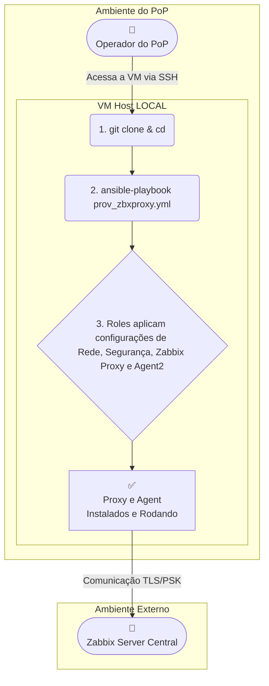

# 🤖 Provisionamento Automatizado de Zabbix Proxy com Ansible

## 📜 Sumário

- [Visão Geral](#visao-geral)  
- [Principais Funcionalidades](#principais-funcionalidades)  
- [Arquitetura de Execução](#arquitetura-de-execucao)  
- [Estrutura das Roles](#estrutura-das-roles)  
- [Começando](#comecando)  
  - [Pré-requisitos](#pre-requisitos)  
  - [Workflow de Provisionamento](#workflow-de-provisionamento)  
- [Configuração Detalhada](#configuracao-detalhada)  
- [Solução de Problemas](#solucao-de-problemas)  
- [Limitações e Observações](#limitacoes-e-observacoes)  
- [Autores](#autores)  

---

## 📖 Visão Geral {#visao-geral}

O projeto automatiza, via **Ansible**, a implantação e configuração completa de um **Zabbix Proxy** em servidores **Debian 12 (Bookworm)**.  
A automação é executada **localmente no host de destino** e inclui:

- Configuração de rede e hardening de segurança (UFW, Fail2Ban, SSH).  
- Instalação e configuração do Zabbix Proxy e Zabbix Agent 2.  
- Registro seguro (TLS/PSK) do Proxy no Zabbix Server.  
- Registro do Agent 2 do próprio host no Zabbix Server.  

O objetivo é fornecer um método rápido, seguro e replicável para implantar novos Zabbix Proxies em Pontos de Presença (POPs) distintos, garantindo um estado final consistente e pronto para produção.  

---

## ✨ Principais Funcionalidades {#principais-funcionalidades}

- 🚀 **Execução Local:** O playbook roda no próprio servidor de destino, simplificando o processo.  
- 🔄 **Automação de Ponta a Ponta:** Desde a rede e segurança até a instalação e registro dos serviços Zabbix.  
- ♻️ **Idempotente:** Pode ser executado várias vezes com segurança, garantindo sempre o estado final desejado.  
- 🌍 **Configuração por Localidade:** Estrutura de `group_vars` que facilita a customização para múltiplos POPs.  
- 🛡️ **Segurança Integrada:** Hardening com firewall (UFW), Fail2Ban e customização do acesso SSH.  
- 🔗 **Integração via API:** Registro automático do Proxy e do Agent 2 no Zabbix Server.  

---

## 🏛️ Arquitetura de Execução {#arquitetura-de-execucao}

A automação acontece inteiramente no Host de Destino. Um operador acessa o servidor, clona o repositório e executa o playbook, que configura a máquina localmente.  
A única comunicação externa é com a API e os trappers do Zabbix Server.  



---

## 🧩 Estrutura das Roles {#estrutura-das-roles}

| Role | Descrição |
| :--- | :--- |
| `setup_context` | **Ponto de Partida.** Identifica o grupo do host no inventário e carrega variáveis correspondentes. |
| `net_security` | **Camada de Base.** Hardening do servidor: hostname, rede, firewall, Fail2Ban e SSH. |
| `zabbix_proxy` | **Aplicação Principal.** Instala e configura o Zabbix Proxy e sua chave PSK. |
| `zabbix_agent` | **Aplicação Auxiliar.** Instala e configura o Zabbix Agent 2 para monitorar o próprio host. |
| `zabbix_server_register_proxy` | **Integração (Proxy).** Registra/atualiza o Proxy via API. |
| `zabbix_server_register_agent` | **Integração (Host).** Registra/atualiza o host correspondente ao Agent 2 via API. |

---

## 🚀 Começando {#comecando}

### ✅ Pré-requisitos {#pre-requisitos}

O **servidor de destino** deve atender aos seguintes requisitos:

- **SO:** Debian 12 (Bookworm)  
- **Usuário:** Com permissões `sudo`  
- **Pacotes Essenciais:**  
  ```bash
  sudo apt update && sudo apt install -y git ansible-core
  ```
- **Coleções Ansible:**  
  ```bash
  ansible-galaxy collection install community.general
  ```
- **Versões Zabbix (testadas):**  
  - `zabbix-proxy-sqlite3=1:7.2.7-1+debian12`  
  - `zabbix-agent2=1:7.2.7-1+debian12`  

---

### ⚙️ Workflow de Provisionamento {#workflow-de-provisionamento}

1. **Clonar o Repositório**  
   ```bash
   git clone https://git.rnp.br/gt-monitoramento/poc-monitoramento.git
   cd dev-zbxproxy/
   ```

2. **Configurar Variáveis**  
   Ajuste os arquivos em `group_vars/` conforme seu ambiente. Veja a seção [Configuração Detalhada](#configuracao-detalhada).  

3. **Executar o Playbook**  
   ```bash
   ansible-playbook -i hosts prov_zbxproxy.yml --limit sigla_do_estado -K
   ```

| Parâmetro | Descrição |
| :--- | :--- |
| `--limit <grupo>` | Executa apenas para o grupo especificado (ex: `ce`). |
| `-K` | Solicita senha do `sudo`. |
| `-v`, `-vvv` | Verbosidade extra para debug. |

---

## 🔧 Configuração Detalhada {#configuracao-detalhada}

1. **Globais (Zabbix Server):**  
   Editar `group_vars/all.yml`:  
   - `zabbix_server_ip`  
   - `zabbix_server_url`  
   - `zabbix_api_token`  

2. **Locais (Proxy):**  
   Criar/editar `group_vars/pops_configs/ce.yml` (exemplo):  
   - Parâmetros de rede  
   - `zabbix_proxy_hostname`  

3. **Segurança:**  
   - Tire **snapshot** da VM antes.  
   - Porta SSH será alterada → confira `ssh_port`.  
   - UFW bloqueará IPs não autorizados → verifique gateway e IP de acesso.  

---

## 💡 Solução de Problemas {#solucao-de-problemas}

| Sintoma | Diagnóstico | Solução |
| :--- | :--- | :--- |
| Proxy não inicia | `systemctl status zabbix-proxy` | Revisar `ServerPort` e diretórios criados. |
| Erro TLS no agente | Log em `/var/log/zabbix/zabbix_agent2.log` | PSK incompatível / cache antigo no server. |
| Agente "Desconhecido" | Conferir configuração do host na UI | O agente do proxy deve ser monitorado **direto pelo Server**. |

---

## ⚠️ Limitações e Observações {#limitacoes-e-observacoes}

- A API do Zabbix não permite associar IP/DNS ao Proxy durante a criação (`proxy.create`).  
- Após rodar a automação, edite manualmente o **endereço do proxy** via UI em `Administração > Proxies`.  

---

## 👨‍💻 Autores {#autores}

- **GT Monitoramento 2025**
