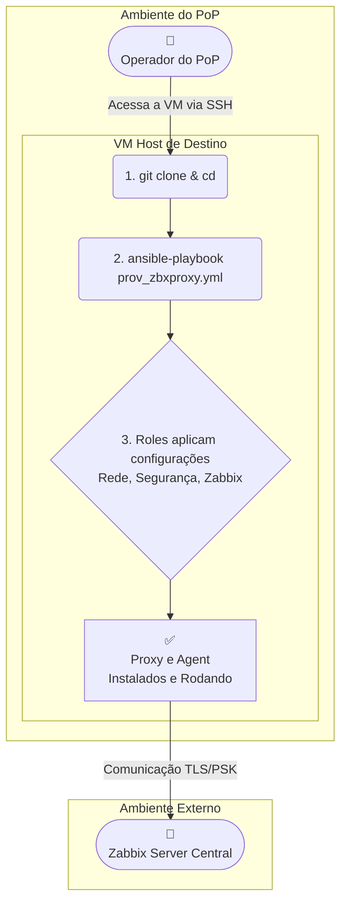

-----

# 🤖 Provisionamento Automatizado de Zabbix Proxy com Ansible

## 📜 Sumário

  - [Visão Geral](# 📖 Visão Geral)
  - [Funcionalidades](https://www.google.com/search?q=%23-principais-funcionalidades)
  - [Arquitetura de Execução](https://www.google.com/search?q=%23%EF%B8%8F-arquitetura-de-execu%C3%A7%C3%A3o)
  - [Estrutura das Roles](https://www.google.com/search?q=%23-estrutura-das-roles)
  - [Começando](https://www.google.com/search?q=%23-come%C3%A7ando)
      - [Pré-requisitos](https://www.google.com/search?q=%23-pr%C3%A9-requisitos)
      - [Workflow de Provisionamento](https://www.google.com/search?q=%23%EF%B8%8F-workflow-de-provisionamento)
  - [Configuração Detalhada](https://www.google.com/search?q=%23-configura%C3%A7%C3%A3o-detalhada)
  - [Solução de Problemas](https://www.google.com/search?q=%23-solu%C3%A7%C3%A3o-de-problemas-troubleshooting)
  - [Limitações](https://www.google.com/search?q=%23%EF%B8%8F-limita%C3%A7%C3%B5es-e-observa%C3%A7%C3%B5es)
  - [Autores](https://www.google.com/search?q=%23-autores)

## 📖 Visão Geral

O projeto automatiza, via **Ansible**, a implantação e configuração completa de um **Zabbix Proxy** em servidores **Debian 12 (Bookworm)**. A automação é executada **localmente no host de destino** e inclui:

  - Configuração de rede e hardening de segurança (UFW, Fail2Ban, SSH).
  - Instalação e configuração do Zabbix Proxy e Zabbix Agent 2.
  - Registro seguro (TLS/PSK) do Proxy no Zabbix Server.
  - Registro do Agent 2 do próprio host no Zabbix Server.

O objetivo é fornecer um método rápido, seguro e replicável para implantar novos Zabbix Proxies em Pontos de Presença (POPs) distintos, garantindo um estado final consistente e pronto para produção.

## ✨ Principais Funcionalidades

  - 🚀 **Execução Local:** O playbook é executado no próprio servidor de destino, simplificando o processo.
  - 🔄 **Automação de Ponta a Ponta:** Provisiona desde a rede e segurança até a instalação e registro dos serviços Zabbix.
  - idempotent **Idempotente:** Pode ser executado várias vezes com segurança, garantindo sempre o estado final desejado.
  - 🌍 **Configuração por Localidade:** Utiliza uma estrutura de `group_vars` que facilita a customização para múltiplos POPs.
  - 🛡️ **Segurança Integrada:** Inclui hardening do servidor com firewall (UFW), Fail2Ban e customização do acesso SSH.
  - 🔗 **Integração via API:** Registra automaticamente o Proxy e o Agent 2 (como Host) no Zabbix Server.

## 🏛️ Arquitetura de Execução

A automação acontece inteiramente no Host de Destino. Um operador acessa o servidor, clona o repositório e executa o playbook, que configura a máquina localmente. A única comunicação externa é com a API e os trappers do Zabbix Server.



## 🧩 Estrutura das Roles

| Role                             | Descrição                                                                                                                |
| :------------------------------- | :----------------------------------------------------------------------------------------------------------------------- |
| `setup_context`                  | **Ponto de Partida.** Identifica o grupo do host no inventário (ex: `[ce]`) e carrega seu arquivo de variáveis (ex: `ce.yml`). |
| `net_security`                   | **Camada de Base.** Realiza o hardening do servidor: configura hostname, rede, firewall (UFW), Fail2Ban e acesso SSH. |
| `zabbix_proxy`                   | **Aplicação Principal.** Instala, configura e gerencia o serviço Zabbix Proxy e sua chave PSK.                             |
| `zabbix_agent`                   | **Aplicação Auxiliar.** Instala e configura o Zabbix Agent 2 para monitorar o próprio host do Proxy.                       |
| `zabbix_server_register_proxy`   | **Integração (Proxy).** Comunica-se com a API do Zabbix Server para criar ou atualizar o registro do Proxy.                  |
| `zabbix_server_register_agent`   | **Integração (Host).** Comunica-se com a API para criar ou atualizar o host correspondente ao Agent 2.                       |

## 🚀 Começando

### ✅ Pré-requisitos

O **servidor de destino** deve atender aos seguintes requisitos:

  - **Sistema Operacional:** Debian 12 (Bookworm)
  - **Usuário:** Um usuário com permissões `sudo`.
  - **Pacotes Essenciais:** `git` e `ansible-core`.
    ```bash
    sudo apt update && sudo apt install -y git ansible-core
    ```
  - **Coleções Ansible:** `community.general`.
    ```bash
    ansible-galaxy collection install community.general
    ```
  - **Versões Zabbix (testadas):**
      - `zabbix-proxy-sqlite3=1:7.2.7-1+debian12`
      - `zabbix-agent2=1:7.2.7-1+debian12`

### ⚙️ Workflow de Provisionamento

#### 1\. Clonar o Repositório

No servidor de destino, clone o projeto:

```bash
git clone https://git.rnp.br/gt-monitoramento/poc-monitoramento.git
cd dev-zbxproxy/
```

#### 2\. Configurar Variáveis

Ajuste os arquivos de configuração em `group_vars/` conforme a necessidade do seu ambiente. Veja a seção [Configuração Detalhada](https://www.google.com/search?q=%23-configura%C3%A7%C3%A3o-detalhada) abaixo.

#### 3\. Executar o Playbook

Use o parâmetro `--limit` para especificar qual configuração de POP será aplicada. Substitua `sigla_do_estado` pela sigla correspondete (ex: `ce`).

```bash
ansible-playbook -i hosts prov_zbxproxy.yml --limit sigla_do_estado -K
```

| Parâmetro           | Descrição                                                     |
| :------------------ | :-------------------------------------------------------------- |
| `ansible-playbook`  | Executa o playbook especificado.                                |
| `-i hosts`          | Define o inventário a ser utilizado.                            |
| `prov_zbxproxy.yml` | Playbook principal da automação.                                |
| `--limit <grupo>`   | Restringe a execução apenas aos hosts de um grupo (ex: `ce`).   |
| `-K`                | Solicita a senha do `sudo` (`--ask-become-pass`).               |
| `-v`, `-vvv`        | Ajusta o nível de verbosidade, útil para depuração.              |

## 🔧 Configuração Detalhada

#### 1\. Configurações Globais (Zabbix Server)

Edite o arquivo `group_vars/all.yml` para configurar a comunicação com seu Zabbix Server Central.

  - `zabbix_server_ip`: IP para o qual o proxy e o agente se conectarão.
  - `zabbix_server_url`: URL base da interface web do Zabbix (para a API).
  - `zabbix_api_token`: Token de API gerado no Zabbix para autenticação.

#### 2\. Configurações Locais (Zabbix Proxy)

Edite (ou crie) o arquivo YAML correspondente ao seu POP em `group_vars/pops_configs/`. Por exemplo, para o Ceará (`ce.yml`):

  - Defina os parâmetros de rede (`pop_network_ipv4_address`, `pop_network_ipv4_gateway`, etc.).
  - Configure o `zabbix_proxy_hostname`.

#### 3\. Recomendações de Segurança

  - **Snapshot:** É altamente recomendado realizar um snapshot da VM antes de executar o playbook.
  - **Acesso SSH:** Após a execução, a porta SSH será alterada para a definida em `ssh_port` e o firewall (UFW) bloqueará conexões de IPs não autorizados. Certifique-se de que o `pop_network_ipv4_gateway` ou seu IP de acesso esteja listado para não perder a conexão.
  - **Interfaces de Rede:** O uso de duas interfaces de rede (uma para gerenciamento, outra para serviço) é uma boa prática.

## 💡 Solução de Problemas (Troubleshooting)

| Sintoma                                                       | Diagnóstico                                                                                                                                     | Causa Comum / Solução                                                                                                                                                                                                                           |
| :------------------------------------------------------------ | :---------------------------------------------------------------------------------------------------------------------------------------------- | :---------------------------------------------------------------------------------------------------------------------------------------------------------------------------------------------------------------------------------------------- |
| **Serviço `zabbix-proxy` não inicia** | `systemctl status zabbix-proxy.service` e `journalctl -xeu zabbix-proxy.service` para ver o erro exato.                           | **Erro: `wrong value of "ServerPort"`:** Causado por um caractere invisível ou formatação no template. Utilize a versão "super limpa" do template `zabbix_proxy.conf.j2`. |
|                                                               |                                                                                                                                                 | **Erro: `No such file or directory`:** Ocorre após limpeza manual. A role `zabbix_proxy` deve ter uma tarefa para criar todos os diretórios necessários (`/var/lib/zabbix`, etc).         |
| **Erro de TLS na UI do Zabbix** (`decode error`, etc.)        | Mensagem de erro na UI (em *Monitoramento -\> Hosts*). Aumentar `DebugLevel` para `4` no `.conf` do agente e verificar `/var/log/zabbix/zabbix_agent2.log`. | **Incompatibilidade de PSK:** Verifique se Chave e Identidade PSK na UI do Zabbix são **idênticas** às dos arquivos do agente. Lembre-se que um caractere de nova linha (`\n`) pode causar isso (use `| trim` ao gerar a chave). |
|                                                               |                                                                                                                                                 | **Cache do Zabbix Server:** O Zabbix Server pode estar usando uma chave antiga. Execute `sudo zabbix_server -R config_cache_reload` no servidor Zabbix para forçar a recarga.                                           |
| **Agente com status "Desconhecido"** | Verificar a configuração do Host na UI do Zabbix.                                                                                               | O host está configurado para ser "monitorado por proxy", mas o proxy é ele mesmo. O agente da máquina do proxy deve ser configurado como **"Monitorado por Servidor"**.                                                           |

## ⚠️ Limitações e Observações

  - **Interface do Proxy via API**: A API do Zabbix não permite associar uma interface (IP/DNS) a um proxy no momento da sua criação (`proxy.create`).
  - **Ação Manual Necessária (Proxy)**: Após a automação, acesse a interface web do Zabbix → `Administração > Proxies`, selecione o proxy criado e adicione manualmente o **Endereço do proxy** (IP ou DNS). *Esta limitação não se aplica ao host do agente, que é criado com sua interface já configurada.*

## 👨‍💻 Autores

  - **GT Monitoramento 2025**