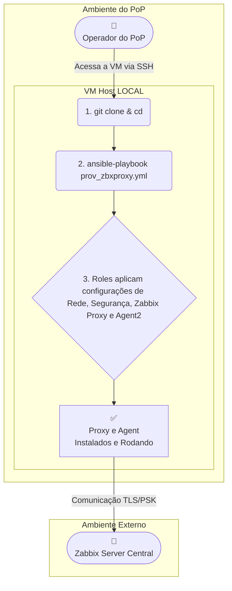

---

# 🤖 Provisionamento Automatizado de Zabbix Proxy com Ansible

Automação completa para instalar, configurar e registrar um **Zabbix Proxy** (e o **Zabbix Agent 2** do próprio host) em **Debian 12 (Bookworm)**. O playbook executa **localmente** no servidor de destino e aplica rede, hardening e integração via API com o Zabbix Server central. ([GitHub][1])

## 📌 Sumário

* [Visão Geral](#visão-geral)
* [Arquitetura (alto nível)](#arquitetura-alto-nível)
* [Estrutura do Repositório](#estrutura-do-repositório)
* [Pré-requisitos](#pré-requisitos)
* [Como começar (passo a passo)](#como-começar-passo-a-passo)
* [Configuração por POP (variáveis locais)](#configuração-por-pop-variáveis-locais)
* [Execução](#execução)
* [Solução de Problemas](#solução-de-problemas)
* [Limitações/Observações](#limitaçõesobservações)
* [FAQ Rápido](#faq-rápido)
* [Créditos](#créditos)

---

## Visão Geral

* Provisiona **Zabbix Proxy (TLS/PSK)** e **Zabbix Agent 2** do próprio host.
* Faz **hardening** (UFW, Fail2Ban, SSH), configura **hostname** e **rede** (Netplan).
* Integra **automaticamente** no Zabbix Server via **API** para registrar **Proxy** e **Host do Agent**.
* Execução **idempotente** e **local** (no próprio servidor de destino). 


---

## Arquitetura (alto nível)

* Operador acessa a VM/servidor do POP, clona este repositório e roda o playbook.
* Toda configuração é aplicada **no host local**; a única comunicação externa é com **API/Trappers** do Zabbix Server para registro do Proxy e do Agent. 


Topologia:




---

## Estrutura do Repositório

```
dev-zbx/
├─ prov_zbxproxy.yml          # Play principal
├─ hosts                      # Inventário Ansible (grupos por POP)
├─ group_vars/
│  ├─ pops_configs/           # Variáveis específicas por POP (ex.: ce.yml, rj.yml, ...)
│  └─ all.yml                 # Variáveis globais utilizadas em todas as roles
├─ roles/
│  ├─ setup_context/          # Descobre contexto do grupo e carrega variáveis
│  ├─ net_security/           # Hostname, netplan, UFW, Fail2Ban, SSH (hardening)
│  ├─ zabbix_proxy/           # Instala e configura o Zabbix Proxy + PSK
│  ├─ zabbix_agent/           # Instala e configura o Zabbix Agent 2
│  ├─ zabbix_server_register_proxy/  # Chama API p/ criar/atualizar Proxy no Server
│  └─ zabbix_server_register_agent/  # Chama API p/ criar/atualizar Host (Agent2)
```

> Os nomes e a divisão das roles seguem o que o próprio projeto descreve: **setup\_context, net\_security, zabbix\_proxy, zabbix\_agent, zabbix\_server\_register\_proxy e zabbix\_server\_register\_agent**. 

---

## Pré-requisitos

No **servidor de destino** (Debian 12):

```bash
sudo apt update
sudo apt install -y git ansible-core
ansible-galaxy collection install community.general
```

Versões Zabbix já validadas no projeto (ajuste se necessário):

* `zabbix-proxy-sqlite3=1:7.2.7-1+debian12`
* `zabbix-agent2=1:7.2.7-1+debian12` 

> ⚠️ O projeto depende de **ambientes/variáveis específicas** para cada POP (e possivelmente de PSKs/Token da API). Não é necessário executar nada fora do host alvo, pois tudo é gerado automaticamente.

---

## Como começar (passo a passo)

1. **Clonar este repositório no host alvo**

```bash
git clone https://git.rnp.br/gt-monitoramento/poc-monitoramento.git
cd dev-zbxproxy/
```

2. **Definir o inventário** em `hosts`

   * Crie/edite um grupo por POP (ex.: `[ce]`) e aponte para `localhost` se a execução for local.

3. **Criar o arquivo de variáveis do POP**

   * Em `group_vars/pops_configs/`, crie **`<sigla_do_estado>.yml`** (ex.: `ce.yml`) com as variáveis do seu ambiente. 

---

## Configuração por POP (variáveis locais)

Crie/edite `group_vars/pops_configs/<sigla>.yml` seguindo o `exemplo` a seguir:

```yaml
# Identidade do Proxy (nome único no ambiente)
zabbix_proxy_hostname: "ce-zabbix-rnp-ger-proxy01"

# Rede (Netplan)
pop_network_ipv4_address: "192.168.0.17/24"
pop_network_ipv6_address: "....."
pop_network_ipv4_gateway:  "192.168.0.9"
pop_network_ipv6_gateway: "....."

pop_network_dns_list:
  - "200.19.16.53"
  - "200.137.53.53"

# Porta customizável para acesso ssh da VM
ssh_port: 25085

```

> Dica de operação:
>
> * Tire **snapshot** da VM antes da primeira execução (mudanças de rede/firewall podem cortar o acesso).
> * Após rodar, o SSH ficará disponível **na nova porta** definida em `ssh_port`.
> * O UFW sobe restritivo, então **libere previamente** o gateway/gestão para evitar bloqueio.

---

## Execução

Rode **no host alvo**:

```bash
ansible-playbook -i hosts prov_zbxproxy.yml --limit <sigla_do_estado> -K
```

Guia rápido do -v para debug:

| Parâmetro | Descrição |
| :--- | :--- |
| `--limit <grupo>` | Executa apenas para o grupo especificado (ex: `ce`). |
| `-K` | Solicita senha do `sudo` da VM. |
| `-v` | Verbose / Detalhado |
| `-vv` | Very Verbose / Muito Detalhado |
| `-vvv` | Verbosidade extra para debug. |
| `-vvvv` | Debug Maximo |

Ex:
   ```bash
   ansible-playbook -i hosts prov_zbxproxy.yml --limit ce -K -v
   ```
---
<a id="resultados-esperados"></a>

## ✅ Resultados Esperados

Após a execução bem-sucedida do playbook, a configuração no Zabbix Server deve se apresentar da seguinte forma. Esta seção serve como um guia visual para confirmar que tudo funcionou corretamente.

### 1. Status do Proxy

Navegue até **Administração -> Proxies** na interface do Zabbix.

Você deverá encontrar o proxy recém-criado com as seguintes características:
-   **Modo:** Ativo
-   **Encriptação:** PSK
-   **Estado:** Online
-   **Última vez visto (idade):** Um valor baixo, como "alguns segundos", indicando comunicação ativa e recente com o Zabbix Server.

**

**

**

### 2. Status do Host (Agente)

Navegue até **Monitoramento -> Hosts**.

Você deverá encontrar o host correspondente ao agente do proxy com os seguintes indicadores:
-   O nome do host (ex: `ce-zabbix-rnp-ger-proxy01`) estará na lista.
-   A coluna **Disponibilidade** mostrará um **ícone ZBX verde**, confirmando que o Zabbix Server está conseguindo coletar dados do agente via TLS/PSK.
-   Ao clicar no host para editar, a opção **Monitorado por** estará corretamente marcada como **Servidor**.

**

**

**


---

## Limitações/Observações

* A API do Zabbix não associa IP/DNS ao Proxy na criação; ajuste **manualmente** na UI após o primeiro registro (**Administração → Proxies**).
* Este projeto foi pensado para execução **local** no host alvo (sem “control node” central).
* Certifique-se de manter as **variáveis globais** alinhadas às diretrizes da sua GER/Backbone quando existirem.

---

## FAQ Rápido

**Posso rodar várias vezes?**
Sim. O play é **idempotente** e deve convergir para o estado desejado. 

**Preciso abrir portas no firewall?**
A role de segurança já libera **SSH** (na porta configurada) e portas do **Zabbix**. Ajustes extras podem ser feitos nas variáveis do POP.

**E se eu quiser MySQL ou outra SGBD?**
O código não irá funcionar. A padronização do uso do `zabbix-proxy-sqlite3` é devido a construção automática do banco de dados. Caso
utilize um SBGD diferente, o banco de dados precisa ser criado manualmente.

---

## Créditos

Criado por **GT Monitoramento 2025**.
---

